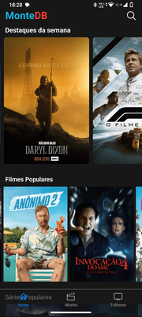
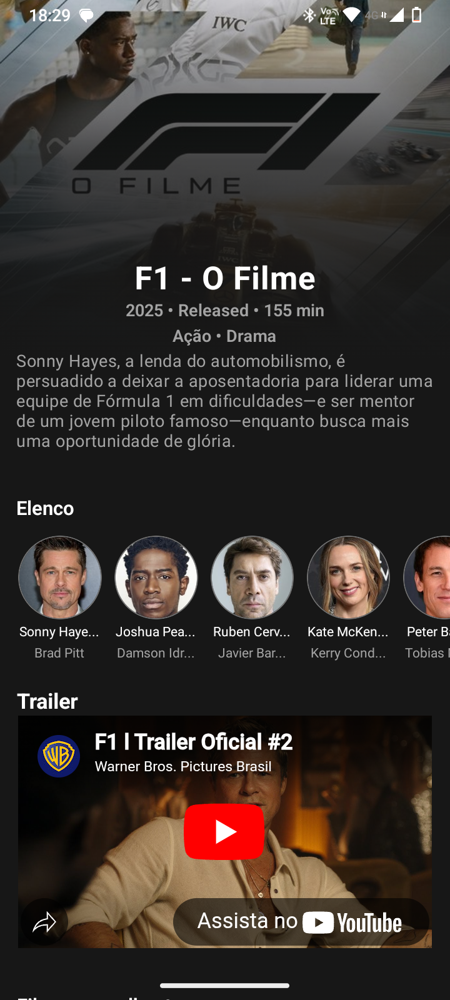
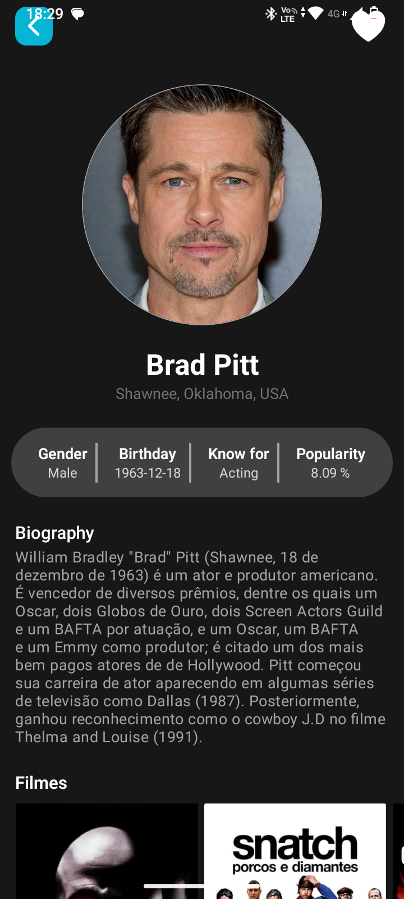

# MonteDB

> App de filmes e séries (React Native + Expo + TypeScript) que consome a TMDb API para exibir informações, trailers e elenco.


---

## **Acessar Aplicativo**

Você pode testar a versão mais recente do aplicativo diretamente pelo **Expo Go**, sem precisar instalar APK ou IPA manualmente.

1. **Instale o app Expo Go**:  
   - [Android (Google Play)](https://play.google.com/store/apps/details?id=host.exp.exponent)  
   - [iOS (App Store)](https://apps.apple.com/app/expo-go/id982107779)

2. **Clique no link abaixo ou escaneie o QR Code dentro do Expo Go**:  
   [🚀 Acessar MonteDB](https://expo.dev/preview/update?message=Update+from+CI&updateRuntimeVersion=1.0.0&createdAt=2025-09-08T19%3A22%3A46.322Z&slug=exp&projectId=12787f66-906e-488a-8bf9-1d93339b3d58&group=8177b595-2c96-4d8a-b2b2-a885ba0d3b18)

> **Observação:**  
> - É necessário estar logado no Expo Go com uma conta gratuita.  
> - Cada nova atualização feita via `eas update` será refletida automaticamente neste mesmo link.  
> - Caso ocorra erro de carregamento, verifique se a branch configurada para o update foi publicada corretamente.

---

## Sumário
- [Sobre](#sobre)  
- [Demonstração / Screenshots](#demonstração--screenshots)  
- [Principais funcionalidades](#principais-funcionalidades)  
- [Tecnologias](#tecnologias)  
- [Pré-requisitos](#pré-requisitos)  
- [Instalação & Execução (Local)](#instalação--execução-local)  
- [Variáveis de ambiente](#variáveis-de-ambiente)  
- [Scripts úteis](#scripts-úteis)  
- [Testes & Lint](#testes--lint)  
- [Build & Deploy (Expo / EAS)](#build--deploy-expo--eas)  
- [CI/CD sugerido (GitHub Actions)](#cicd-sugerido-github-actions)  
- [Estrutura do projeto (resumida)](#estrutura-do-projeto-resumida)  
- [Contribuição](#contribuição)  
- [Licença](#licença)

---

## Sobre
**MonteDB** é um aplicativo mobile construído com **Expo + React Native + TypeScript**, integrado com a **TMDb API** para buscar detalhes de filmes e séries, exibir trailers, e informações do elenco.

---

## Demonstração / Screenshots
<div style="display: flex; gap: 10px;">
  
  
  
  
</div>
---

## Principais funcionalidades
- Busca de filmes e séries (via TMDb).  
- Páginas de detalhe com sinopse, nota, data e trailer.  
- Lista de elenco / atores.  
- Navegação entre telas (React Navigation).  
- Temas e estilização com Tailwind (configuração presente no repo).

---

## Tecnologias
- React Native (Expo)  
- TypeScript  
- Tailwind / Nativewind  
- TMDb API (The Movie Database)  
- Metro / Babel (configurações já no repo)  
- (Opcional) Expo EAS para builds/updates

---

## Pré-requisitos
- Node.js 18+ ou 20+ (recomendado).  
- npm (ou yarn/pnpm)  
- Expo CLI (opcional, para dev local): `npm install -g expo-cli`  
- Conta Expo (se for usar `eas build` / `eas update`)  
- TMDb API Key (obter em https://www.themoviedb.org/settings/api)

---

## Instalação & Execução (Local)

1. **Clonar repositório**
```bash
git clone https://github.com/liviocandman/MonteDB.git
cd MonteDB
```

2. **Instalar dependências**
```bash
npm ci
# ou
# yarn install
```

3. **Criar arquivo de variáveis de ambiente**
Crie `.env` na raiz (ex.: `.env.local`) baseado no modelo abaixo.

4. **Executar em modo desenvolvimento (Expo)**
```bash
npm run start
# ou
expo start
```
- No terminal do Expo você pode rodar no emulador Android / iOS ou abrir via Expo Go no seu celular.

---

## Variáveis de ambiente

Crie um arquivo `.env` (não comite esse arquivo) com as variáveis necessárias. Exemplo mínimo:

```
TMDB_API_KEY=seu_tmdb_api_key_aqui
EXPO_PUBLIC_API_BASE_URL=https://api.themoviedb.org/3
```

> Se no seu projeto houver outro nome para a variável, ajuste conforme o código (procure por `process.env` no `src/`).

**Sugestão:** criar também `.env.example` com variáveis vazias (ex: `TMDB_API_KEY=`) e commitar esse `.env.example`.

---

## Scripts úteis (exemplo)
> Ajuste conforme seu `package.json`. Se esses scripts não existirem no repo, adicione-os.

```json
"scripts": {
  "start": "expo start",
  "android": "expo start --android",
  "ios": "expo start --ios",
  "web": "expo start --web",
  "build:web": "expo export:web",
  "test": "jest --ci --watchAll=false",
  "lint": "eslint . --ext .js,.jsx,.ts,.tsx"
}
```

---

## Testes & Lint
- **Lint**: configure rules com ESLint + Prettier; rode `npm run lint`.  
- **Testes**: se houver Jest (ver `package.json`), rode `npm run test`. No CI recomendamos `jest --ci --watchAll=false`.

---

## Build & Deploy (Expo / EAS)
### Opções:
- **Atualizações OTA ( rápido )**: `eas update` ou `expo publish` — envia apenas código JS/assets para CDN do Expo.
- **Binários (playstore / app store)**: `eas build --platform android` / `eas build --platform ios` — gera APK/AAB/IPA; requer credenciais e configuração `eas.json`.

### Exemplo rápido (EAS):
```bash
# autenticar
npx eas login

# publicar update OTA
npx eas update --branch production --message "Atualização automática"

# ou gerar build
npx eas build --platform android --profile production
```

---

## CI/CD sugerido (breve)
Sugestão: GitHub Actions com dois jobs:
1. **CI**: checkout → setup Node → `npm ci` → lint → test → build web (opcional).  
2. **CD**: autenticar Expo (`EXPO_TOKEN` no Secrets) → `npx eas update` ou `npx expo publish` / `npx eas build`.  

---

## Estrutura do projeto (resumida)
```
MonteDB/
├── assets/              # imagens e ícones
├── src/                 # código fonte (componentes, screens, services)
├── App.tsx
├── app.json
├── package.json
├── tsconfig.json
├── tailwind.config.js
└── README.md
```
